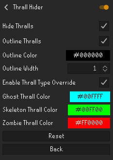

# Thrall Highlighter
A way to highlight and hide thralls in a single plugin.

## Purpose
The purpose of this plugin is to have a single plugin that consolidates the useful feature of the **_[Entity Hider](https://github.com/runelite/runelite/wiki/Entity-Hider)_** plugin to hide thralls, as well as the **_[Better NPC Highlight](https://runelite.net/plugin-hub/show/better-npc-highlight)_** plugin to outline thralls. This is particularly useful when you want to be able to toggle the **_Entity Hider_** plugin whilst keeping thralls hidden.

## Features

- Thrall Outline Display
- Thrall Hider
- Thrall Type Specific Colours **(new!)**

### Configure Menu

## Bugs and Others

The plug-in does not hide and accurately outline the thralls with the **_[Companion Pet](https://runelite.net/plugin-hub/show/companion-pet)_** plugin. Please issue issues for issues.
